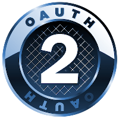

### OAuth 2.0 - Password Credentials Grant 

NOTE: READMe will be completed later. I only work on this during my free time. Will be back to complete detailed info on steps. 

# BRIEF OVERVIEW 
Hey, this is me trying to briefly work out a practical implementation of the OAuth 2.0 framework. 

OAuth is simply a token based standardardized authorization framework. The current standard being OAuth 2.0. Primarily, it allows organizations to share resources of a User (the resource owner) with a third party client (known in this case as the Client).

For this, I am using Laravel Passport which is built on top the * League OAuth2 server * maintained by Andy Millington and Simon Hamp. According to the documentation, there are basically 4 ways we can retrieve a token to be used. 

1. Authorization code grant
2. Client credentials grant
3. Implicit grant
4. Password credentials grant
5. Refresh grant

For this example, I will be using the Password Credentials Grant approach. 

USE CASE:
For your first party apps. Let's say you have an API on a server called "Resource".
This API is strictly for showcasing posts written and posted by your users on Resource.

When you release a desktop app (a first party app) in this case, you may choose to also allow users from the desktop app make requests and consume their APIs from "Resource".

You trust Desktop because you built it, you own it. it it also part of your suites of apps. Another being mobile app, carton etc

So when your users decide to come through Desktop, they are given a login field to enter their details. They enter their details and desktop sends these details to Resource, and since Resource already knows anf trusts Desktop, it receives this info and in turn, issues out a token to that user on Desktop trying to make this request. 

This approach is different from the OAuth Authorization Code which is much longer because it involces a third party app, and that's why you get so many redirects here and there while using that approach. 

With this, it's pretty simpler since all the apps are part of one big family. 

As sweet as this method is, it is highly discouraged and advised against. So use with caution or Never use at all.

## STEPS
1. Clone the repo
2. cd into client
3. Run php artisan serve --port=1111 (You can use any port number you like)
4. cd out cd ..
5. cd into resource
6. Run php artisan migrate (to run all migration files)
7. Run php artisan passport:client --password (to create a client ID and a secret for the client)
8. Copy the client ID and client secret received and save it somewhere for now. We will need it soon.
9. Run npm install (to install all dependencies)
10. Run php artisan serve --port=2222 (You can use any port number. Just make sure it is different from client)
11. 
